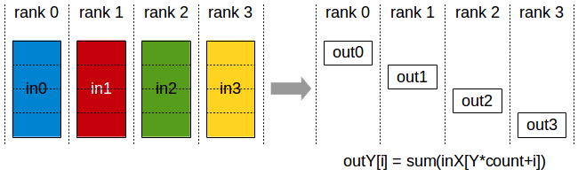
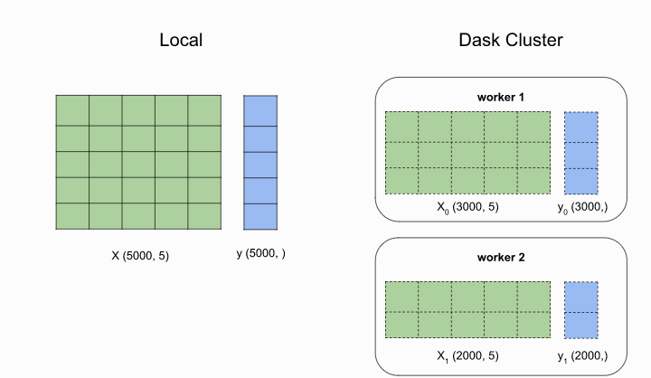

### Research Questions

In 2018, 260 million children weren't attending school. At the same time, more than half of these young students didn't meet minimum reading and math standards. Education was already in a tough place when COVID-19 forced most countries to temporarily close schools. This further delayed learning opportunities and intellectual development. The equity gaps in every country could grow wider. We need to re-think the current education system in terms of attendance, engagement, and individualized attention.

Due to the recent COVID-19. Many students has witch to online educational courses, material, and environments. As these platforms provide a significant amount of information for students’ learning activities, attentiveness, and performance, they can provide valuable data for further analysis to improve on the online learning experience.

Therefore, the topic of Knowledge Tracing has become highly essential and has gained considerable attention from the research community. Knowledge tracing (KT) can be defined as the task of modeling students’ comprehension regarding knowledge concepts (KCs) upon their interactions with a series of learning tasks, exercises, and coursework. Accordingly, an accurate KT model can be utilized to predict students’ performance in future interactions, which was our goal during this project. Hence, knowledge tracing is crucial for providing students with personalized learning experiences, which allows them to choose subjects based on their needs and obtain relative knowledge with appropriate tasks and exercises

In this project, I created algorithms for "Knowledge Tracing," the modeling of student knowledge over time. The goal is to accurately predict how students will perform on future interactions. The algorithms will help tackle global challenges in education. If successful, it’s possible that any student with an Internet connection can enjoy the benefits of a personalized learning experience, regardless of where they live. The education policy-makers and education resource providers can build a better and more equitable model for education in a post-COVID-19 world.

### Data Description

 Our model accepts the Riiid! Answer Correctness Prediction dataset, which is provided on Kaggle, as input. There are questions and responses in this dataset. Its main feature is that questions are bundled together; that is, questions relating to a common topic are offered together. 

- Raw features: student_id, question_id, student_answer, elapsed_time…
- Target: Binary label indicating whether the student answers the question correctly
- Size: 5.58GB, 101,230,333rows 

### Seriel Computation Bottlenecks

- The data is very large, for this wave, there are more than 100M rows. It would take a very long time for pandas to read and the do operations or visulizations. 
- It would take a long time to train machine learning model or use cross validation to tune the parameters using local machine.

### Large Scale Computing Solution

#### Exploratory Analysis on Dask

The exploratory analysis could be found in the [notebook](EDA.ipynb)

#### Distributed LightGBM

As with other gradient-boosted decision tree algorithms, LightGBM builds trees one node at a time. In tree building, a set of possible split points (tuples of (feature, threshold)) is generated, and then the split points are evaluated. We choose the one that reduces loss the most and add it to the tree. By doing this, nodes are added to the tree until tree-specific stopping conditions are met. Until the model-wide stopping conditions are met, trees are added to the model in this manner. We can make a prediction with the model by passing new data through all of the trees and adding their outputs.

Due to the need to build trees sequentially like this, GBDTs cannot benefit from parallel building trees like random forests can. It is still possible to speed them up by adding more memory and CPU power. The reason for this is that the work needed to choose a new tree node can be parallelized.

LightGBM offers two types of distributed training: data-parallel and feature parallel.

The training data is partitioned horizontally in Data-Parallel distributed learning. The workers do not contain all rows from the training data, they only contain a subset. Each worker builds a local feature histogram for all features when a node needs to be added to the current tree, based on the chunk of training data on the instance. The cluster then performs a "Reduce Scatter" (see image below), in which each worker merges feature histograms for a subset of features, and then synchronizes the global best splits back to the other workers. It is appropriate to use Data Parallel mode when training data is very large.

The training data is replicated to each worker in Feature Parallel distributed learning. Each worker searches split points over a subset of the features whenever a node needs to be added to the current tree. Each worker is responsible for communicating the best splits for the features that it is responsible for. The Feature Parallel mode is suitable when the training data comfortably fits in memory on each worker, and when the datasets are wide (many features). 

### 

While setting up for training, ``lightgbm`` wil concatenate all of the partitions on a worker into a single dataset. Distributed training then proceeds with one lightGBM worker process per Dask worker.

In our case, the training dataset is very large (many rows), while we only have around ten features, so we applied data-parallel method. The code for distributedLightGBM could be found [DistributedLightGBM](DistributedLightGBM) The LightGBM achieved an AUC of 0.78

### Pyspark Machine Learning Pipeline

We established the [machine learning pipeline on Pyspark](final-pyspark.ipynb), which could be used for Logistic Regression, decision tree classifier, RandomForest classifier. 

The results are : 

- LogisticRegression AUC = 0.5588427383284462
- DecisionTreeClassifier AUC = 0.534533167057924
- RandomForestClassifier AUC = 0.5782046231409025

The logistic regression, decision tree classifier and random forest classifier is inferior than the distributed lightGBM.

### Why using Dask for Distributed lightGBM instead of using Pyspark?

There are some renaming events happened in Pyspark two month ago, so there are a lot of errors during the installing process. 